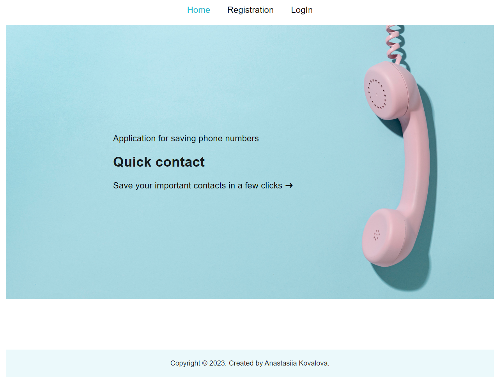
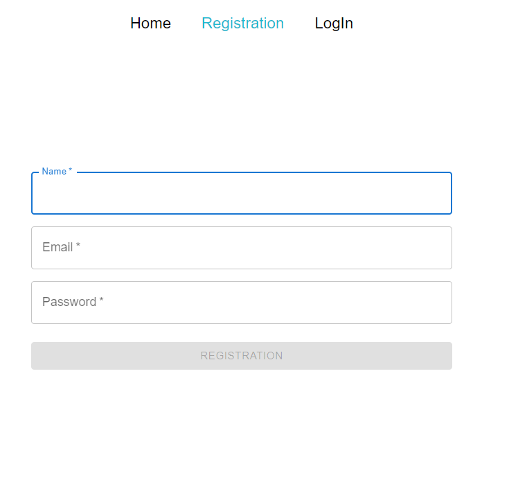
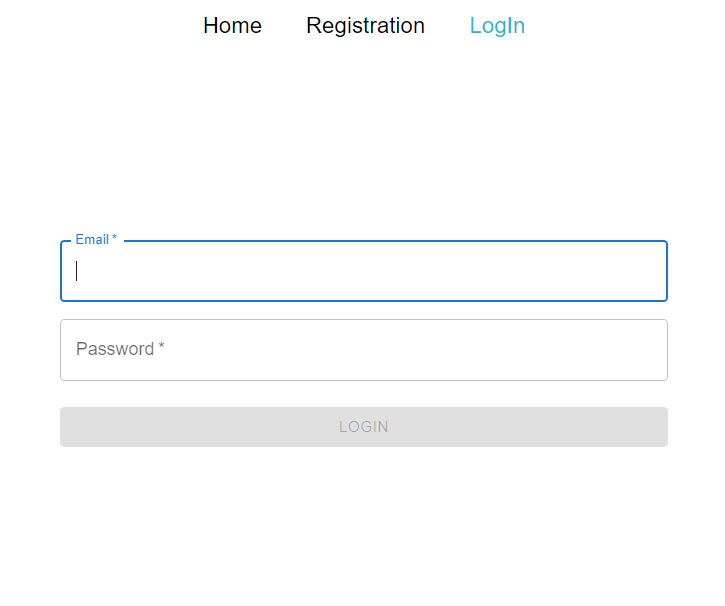
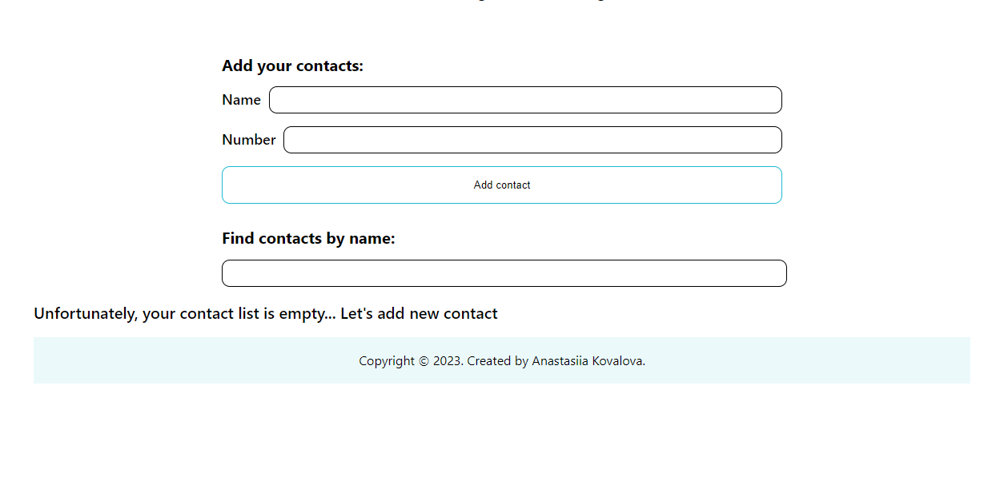

# Phonebook_app - Online application for saving your contacts

## Project Description
Phonebook_app This is a simple React web app that allows you to maintain a list of contacts in your phonebook.

## Technical Details
- **Technologies**: React, React Router, Axios, JS.
- - **Routing**: We use React Router to create the following routes:
- `/home` - Home page with a general description of the services.
- `/registration` - Page for registration new user.
- `/login` - Page for user's logIn.
- `/contacts` - Page where user can add and delete contacts.

## Working with the application

- ### Full functionality available only when user register and log in to the account.

- ### After registration and logging in to their account, the user has the option of adding contacts or deleting existing ones.

## Main Authors
- [Author's GitHub Profile](https://github.com/kovalovaanastasiia)
